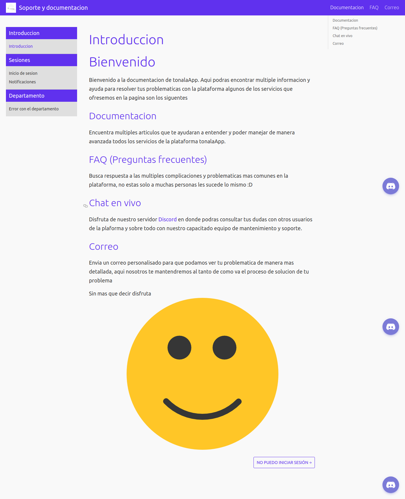
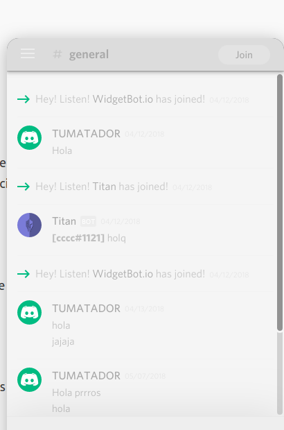
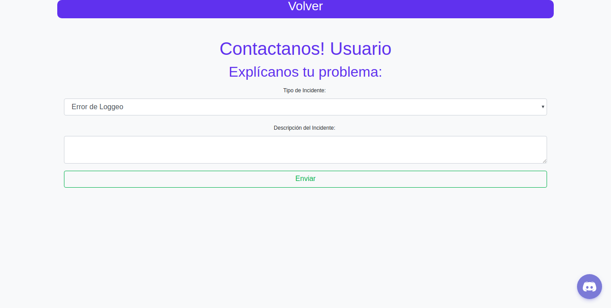

# Documentacion-Docusaurus
Necesitas docusaurus para poder ejecutar el sitio [instalacion](https://docusaurus.io/docs/en/installation)

----------

## Indice de la apicacion


##Chat 


##Correo con problematica 


#Ejecucion 

dirigete a el directotio website y ejecuta el comando
```bash
yarn start
```
aparecera un mensaje como el siguiente 
`yarn run v1.9.4
warning package.json: No license field
warning ../../../package.json: No license field
$ docusaurus-start
Starting Docusaurus server on port 3000...
Open http://localhost:3000/
`
abre tu pagina con el siguiente link 
[localhost:3000](http://localhost:3000/)